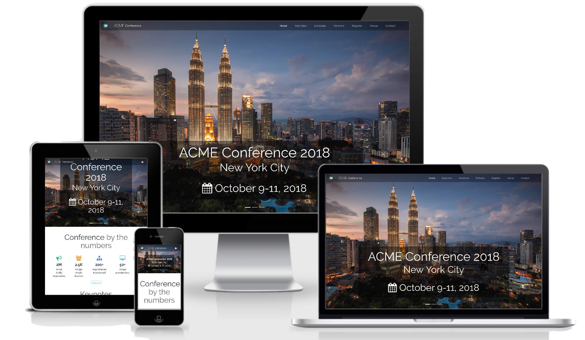
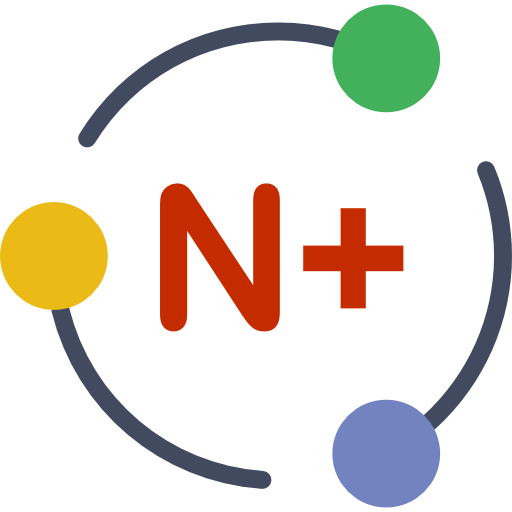

# Conference One

Conference One is an one page, Bootstrap 4 template, suitable for academic conferences and events. It can also be used in technology conferences and exhibitions, product release events, business conferences etc.

## Features

### End user
* Focused on simplicity and user experience
* Full responsive, functionallity supported on mobile devices
* Detailed multi-day schedule/program block view, with support for parallel sessions
* Unlimited themes. Comes out of the box with full support for [Bootswatch](https://bootswatch.com/4-alpha/) themes (more than 20 Light and Dark themes available)
* Font awesome support (and any font icon via Bower)
* Working registration and subscription forms 1
* Price table for different registration types2
* Detailed Google map and Venue information
* Blocks for sponsors, keynote speakers, hotels, media content
* Many little details that we encourage to discover your self

1 PHP required. For the mail functions to be available, PHP requires an installed and working email system. Usually this is available in most hosting providers
 
2 Online payment for registration is not supported

### Developer
<i>(Please see our [gulpfile](app/templates/gulpfile.js) for up to date information on what we support)</i>

* [Bootstrap 4](https://v4-alpha.getbootstrap.com)
* [ES2015 features](https://babeljs.io/docs/learn-es2015/) using [Babel](https://babeljs.io)
* CSS Autoprefixing
* Built-in preview server with BrowserSync
* Automagically compile Sass with [libsass](http://libsass.org)
* Automagically lint your scripts
* Map compiled CSS to source stylesheets with source maps
* Image optimization
* Automagically wire-up dependencies installed with [Bower](http://bower.io)

&copy; 2017  NoesisPlus Themes

Follow us: [@noesisplus](https://twitter.com/noesisplus)

