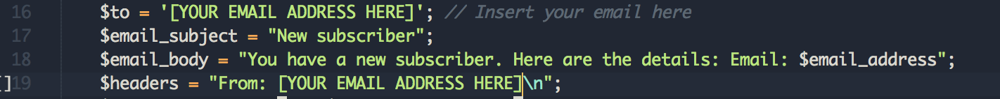

# Components

If you are new to Bootstrap, please visit the official Bootstrap [documentation](https://v4-alpha.getbootstrap.com/getting-started/introduction/) page. A very informative cheatsheet is available [here](https://hackerthemes.com/bootstrap-cheatsheet/).

## Carousel
The carousel is a slideshow for cycling through a series of content. It works with a series of images, text, or custom markup. It also includes support for previous/next controls and indicators.

Please be aware that carousels are generally not compliant with accessibility standards.

Images are located in the folder `images/carousel/`

The recommended size of the carousel images is: `1920x1280` 

## Agenda and program
Conference One supports full multi-day agenda/program with support for paralles sessions. Replace the current information in the `index.html` file with the actually information 

## Keynote speakers
Images for Keynote speakers block are located in the folder `images/people/`

The recommended size of the carousel images is: `640x427` 

## Map
In order to work with the Google Map block, you need first to register for an API Key. You can register for an API Key [here](https://developers.google.com/maps/documentation/javascript/get-api-key)

At the very bottom of the `index.html` page, put your api key in the following line:
`            
` 

In order to display the right place on the map you need to enter the longtitute and latitude values. This can be done in the `main.js` file in the line 27, as show in the following image ( `LatLng` attribute):

## Registration form
Conference One includes a working registration form. There are some basic fields that you can use, or create your own fiels. 

After a client registers, the systems send an email to you with, including all fiedls of the registration form:

In order to configure the correct email address, open the `register.php` file and replace with your email address.

PHP required. For the mail functions to be available, PHP requires an installed and working email system. Usually this is available in most hosting providers

Things to know:
* All fields are mandatory
* There is a basic validation function for every field
* The registration information 
* You can add as many new fields as you wish. All new fileds will have the same basic validation and it will included in the infomation email that you'll receive after each registration

## Subscription form
Conference One includes a working subscription form. In order to use it, open the `subscribe.php` file and replace with your email address:

&copy; 2017  NoesisPlus Themes

Follow us: [@noesisplus](https://twitter.com/noesisplus)

