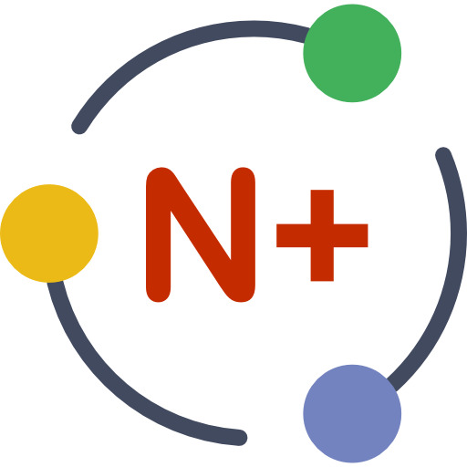

# Getting Started

If you are new to Bootstrap, please visit the official Bootstrap [documentation](https://v4-alpha.getbootstrap.com/getting-started/introduction/) page. A very informative cheatsheet is available [here](https://hackerthemes.com/bootstrap-cheatsheet/).

## Prerequisites 
Both the CLI and generated project have dependencies that require Node 6.0.0 or higher, together with NPM 3 or higher, Gulp and Bower.
- Install [Node](https://nodejs.org/en/)
- Install [npm](https://www.npmjs.com/get-npm?utm_source=house&utm_medium=homepage&utm_campaign=free%20orgs&utm_term=Install%20npm)
- Install Gulp and Bower: `npm install --g gulp-cli bower`

## Quick start
- Run `gulp serve` to preview and watch for changes
- Run `bower install --save <package>` to install frontend dependencies
- Run `gulp serve:test` to run the tests in the browser
- Run `gulp` to build your webapp for production (under folder `dist/`)
- Run `gulp serve:dist` to preview the production build

## Static version
What if you want to work using plain HTML, CSS and JScript?
Simply, copy the contents of the `dist_static` folder and start the development in plain HTML, CSS and Javascript

&copy; 2017  NoesisPlus Themes

Follow us: [@noesisplus](https://twitter.com/noesisplus)

