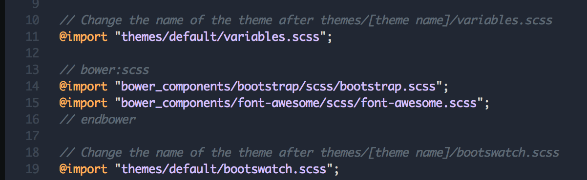

# Themes

Conference One comes with the default Bootstrap 4 theme out of the box.

You can use any Bootstrap 4 compatible theme.

There is also full support for [Bootswatch](https://bootswatch.com/4-alpha/) themes. Currently 20 Bootswatch themes are supported. 

In order to use another theme, open the `main.scss` file and replace the `default` theme in the path with any of the following values:  `cerulean, litera, minty, slate, united, cosmo, flatly,`
`lumen, pulse, solar, yeti, cyborg, lux, sandstone,`
`spacelab, darkly, journal, materia, simplex, superhero`

(lines `11` and `19`)

ATTENTION: do not capitalize the names of the themes

IMPORTANT: do not change the order of the lines in the `main.scss` file

You can also use your own `_variables.scss` and `_bootswatch.scss` files.

<strong>
After changing theme, use `gulp build` to build your app in the `dist` folder.
</strong>

&copy; 2017  NoesisPlus Themes

Follow us: [@noesisplus](https://twitter.com/noesisplus)

